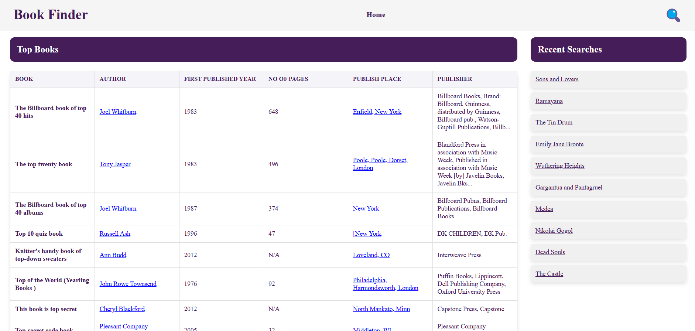

# Book Finder Application

## Description
The Book Finder Application is a React-based web app that allows users to search for books from the Open Library API. Users can search by various criteria, including book title, author name, publish year, and publish place. The application displays a list of books, and if fewer than 10 valid books are found, it will show placeholder "N/A" books at the bottom of the list.

This app also features responsive design, local storage support for saving recent searches, and error handling for failed API requests.

## Features
- **Search**: Allows users to search for books by title, author, or other criteria.
- **Top Books**: Displays up to 10 books per search query.
- **Recent Searches**: Shows recent search terms on the sidebar.
- **Error Handling**: If the API request fails, a message will be displayed.
- **LocalStorage**: Caches top 10 books to persist data between sessions.
- **Responsive Design**: The layout adjusts to different screen sizes.

## Technology Stack
- **Frontend**: React.js
- **API**: Open Library API (for fetching book data)
- **State Management**: React hooks (`useState`, `useEffect`)
- **Styling**: CSS (Flexbox and responsive layout)
- **LocalStorage**: To store recent searches and top 10 books

## Screenshots


## Installation

### 1. Clone the repository
```bash
git clone https://github.com/Iqbal4043/book-finder.git
